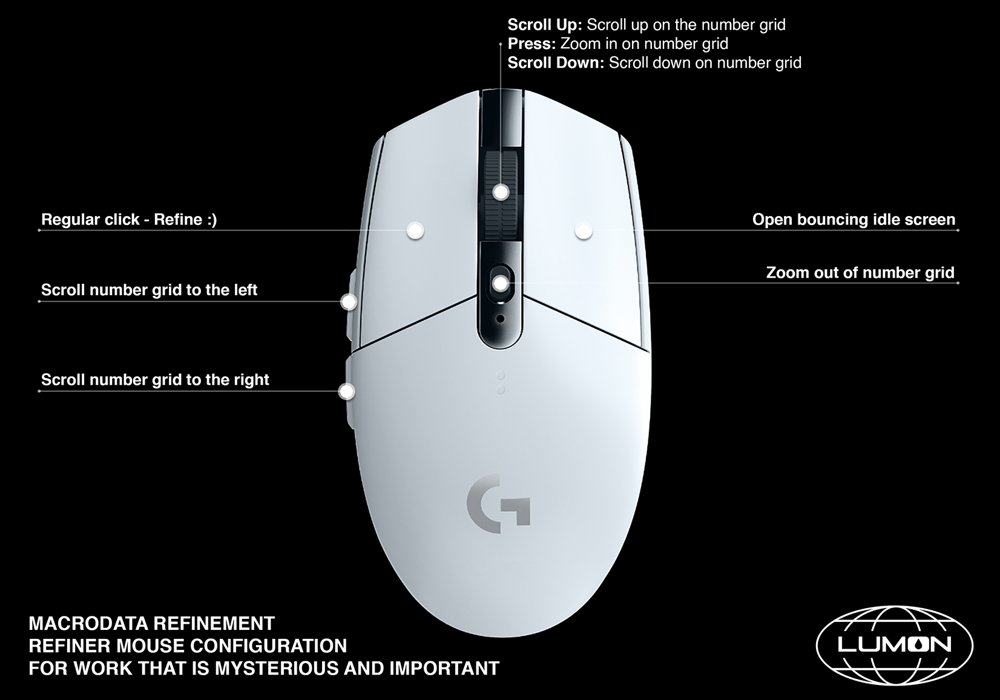

# Introduction

The goal of this project was to create a working miniature desktop display inspired by the 'Macrodata Refinement' computers featured in Apple TV's *Severance*. This build consists of two key aspects: the **software** and the **hardware design**, both outlined below.

Feel free to email comments, suggestions, or inquiries directly to andrewchilx@gmail.com.

---
---

# I. The Software

#### Objectives

  - Generate a randomized **number grid** with grouped 'bad numbers'.  
  - Animate and style the **interface** to match the aesthetics of the show. 

## a. The Number Grid  

> **GENERATE**  
  - A *N×N* grid is created.  
  - Each cell is filled with a random integer between 0-9.  

> **MAP**  
  - A Perlin noise map assigns smooth gradient values to the grid.  
  - This ensures numbers are naturally grouped rather than randomly scattered.  

> **THRESHOLD**  
  - Each cell's value is compared to a set threshold.  
  - Values above the threshold are marked as 'bad'/'scary' numbers.  

> **GROUP**  
  - 'Bad' numbers are grouped based on proximity to one another.  
  - At random intervals, a group visible in the viewport will be activated:  
    - If hovered over, they become 'super active', extending their active time and appearing agitated.  
    - If clicked, the group is **'refined'**, animating into a pre-determined bin and resetting as no longer 'bad'.  

## b. The Interface

- A moving Perlin noise map offsets each number (vertically or horizontally).  
- Activated bad groups expand / contract / jitter.
- Numbers scale-up based on cursor position.
- Refined groups animate into bins, with a percent bar keeping track of your progress.  

#### Additional Features:
- The application is cross-compatible, allowing compilation for both Linux and Raspberry Pi (ARM).
- A *'debug mode'* reveals various settings (which can be saved / loaded from disk as JSON).
- An *'idle mode'* can be enabled to display the Lumon logo screensaver.
- The user can navigate the full grid using arrow and zoom keys.
- Clicking on the Lumon logo in the top right corner opens a menu with a safe-shutdown option to safely power down the Raspberry Pi without corrupting the SD card. An inline switch was included to cut power to the Pi after shutdown.

---
---

# II. Hardware Design

#### Objectives

  - Reconstruct the computer housing from the show as a printable 3D model.
  - Design the interior to support a RaspberryPi and LCD screen 

- The computer's outer shell was modeled in Blender from the ground up, closely following reference images from the show to capture the original look.
- The design was then optimized for 3D printing.
  - The structure was made modular, allowing for easy assembly and disassembly.
  - Each part includes a flat printing surface, enabling clean prints without the need for supports.
  - Tolerances were incorporated to ensure a snug fit for all components.
- Finally, the interior was equipped with an adjustable Raspberry Pi mount.
  - The mounting bracket can move laterally, and the RPi forward, allowing for fine-tuned alignment of the LCD screen with the front panel.

---
---

# III. Building and Running the Software

Follow these steps to build and run the application on a Raspberry Pi:

### Prerequisites
- Enable SSH on your Raspberry Pi using `sudo raspi-config` to allow remote access
- Basic knowledge of terminal commands

### Step 1: Install Dependencies
```bash
sudo apt install cmake build-essential libglfw3-dev libgl1-mesa-dev libx11-dev libxrandr-dev libxinerama-dev libxxf86vm-dev libxcursor-dev pkg-config libopengl-dev libglew-dev
```

### Step 2: Clone the Repository
```bash
git clone https://github.com/[repository-url].git /path/to/project
cd /path/to/project
```

### Step 3: Build the Application
```bash
mkdir -p build
cd build
cmake ..
make
```

### Step 4: Copy Required Assets
Return to the main project directory to copy the assets folder and the Raspberry Pi-specific settings file to the build directory:
```bash
cd /path/to/project
cp -r assets/ build/
cp settingsRPI.json build/settings.json
```
> **Note:** The Raspberry Pi requires specific settings optimized for its hardware capabilities. The `settingsRPI.json` file contains these optimized settings and is copied as the default `settings.json` file.

### Step 5: Run the Application
```bash
cd /path/to/project/build
./LumonMDR --full-screen
```

---
---

# IV. Controller Configuration

I used the Logitech G305 mouse due to its onboard memory. I set the key bindings in the G Hub application on Windows, saved the configuration to the mouse onboard memory, and then put the USB receiver into the Raspberry Pi for it to carry over its custom configuration.



---
---

# V. Final Product

<table>
  <tr>
    <td></td>
    <td></td>
  </tr>
  <tr>
    <td></td>
    <td></td>
  </tr>
</table>


---
---

# VI. Setting Up AutoStart

Follow these steps to configure the application to start automatically when your Raspberry Pi boots up.

### Prerequisites
- Enable SSH on your Raspberry Pi using `raspi-config` to allow remote access.

### Step 1: Create the X-Server Wait Script
This script ensures the application doesn't start until the X server is fully loaded.

```bash
sudo apt install x11-utils
sudo nano /path/to/wait-for-x.sh
```

Paste this inside:
```bash
#!/bin/bash

# Wait until the X server is up by checking for the DISPLAY
export DISPLAY=:0

# Loop until xdpyinfo succeeds
until xdpyinfo >/dev/null 2>&1; do
    echo "Waiting for X server..."
    sleep 1
done

exit 0
```
Save and exit (Ctrl + O, Enter, Ctrl + X)

Make the script executable:
```bash
chmod +x /path/to/wait-for-x.sh
```

### Step 2: Create the Lumon Service File
```bash
sudo nano /etc/systemd/system/lumon.service
```

Paste this inside:
```
[Unit]
Description=Start LumonMDR on boot
After=graphical.target
Wants=graphical.target

[Service]
ExecStartPre=/path/to/wait-for-x.sh
ExecStart=/path/to/build/LumonMDR --full-screen
WorkingDirectory=/path/to/build
Restart=on-failure
User=pi
Environment=DISPLAY=:0
Environment=XDG_RUNTIME_DIR=/run/user/1000

[Install]
WantedBy=graphical.target
```
Make sure the wait-for-x.sh path matches where you created the script.

### Step 3: Enable the Service
```bash
sudo systemctl daemon-reload
sudo systemctl enable lumon.service
sudo systemctl start lumon.service
```

### Step 4: Verify Setup
Check the status of the service:
```bash
systemctl status lumon.service
```

If it's not active, check the logs:
```bash
journalctl -u lumon.service
```

Reboot to test automatic startup:
```bash
sudo reboot
```